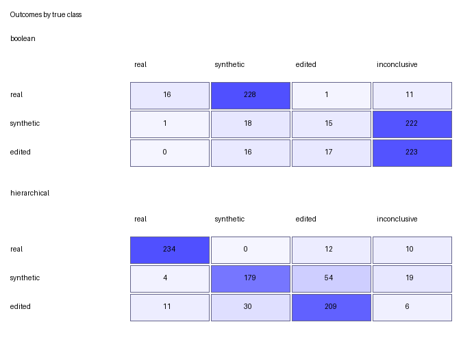
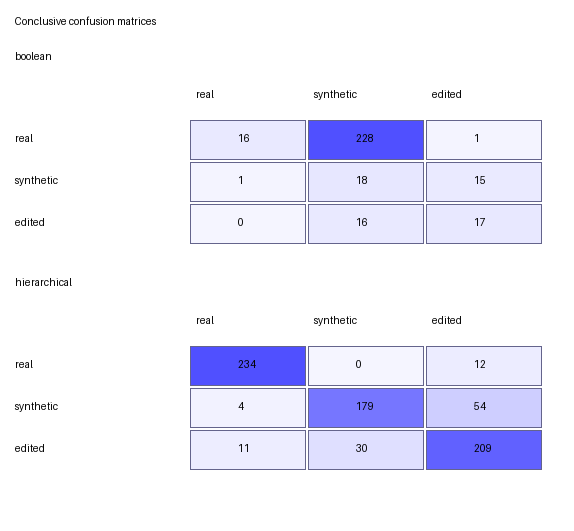

# Learned hierarchical aggregation

This experiment replaces the negative Boolean aggregation baseline with the
prespecified two-level learned hierarchy in
[`hierarchical-aggregation-plan.md`](hierarchical-aggregation-plan.md). The
detector adapters, upstream revisions, checkpoints, preprocessing, and raw
score definitions remained frozen. Only the aggregation policy was fitted.

The result supports continued development of the hierarchy: it passed every
prespecified engineering gate in grouped out-of-fold calibration and in the
retrospective comparison. It is not independent confirmation of broad
generalization. The earlier comparison corpus motivated the hierarchy and
must not be used to revise this frozen policy.

## Frozen calibration evidence

- Protocol: `diffdetect-hierarchical-calibration-v1`
- Samples: 768, balanced with 256 `real`, 256 `synthetic`, and 256 `edited`
- Manifest SHA-256:
  `5a23bee4f802b9c88dd41030711aee173d27a3f8974371153439c0c363cde3a5`
- Complete raw-result SHA-256:
  `f104b2ea9b08e25122382583e081a6216b079f26f30c358e6c660edd53f7f27b`
- DistilDIRE errors: 0
- DinoLizer errors: 0
- Calibration/comparison overlap: 0 sample identifiers, source identifiers,
  or input hashes
- Features: DistilDIRE score, DinoLizer p99 score, and DinoLizer marked area

The inference completed on a Tesla T4 with Python 3.13.15, PyTorch
2.11.0+cu130, torchvision 0.26.0+cu130, and CUDA 13.0. The complete CSV and
metadata preserve detector revisions, model hashes, timings, and the explicit
fact that no aggregation policy was applied during feature extraction.

## Fitting protocol

The policy uses one shared standardization followed by two L2-regularized
logistic regressions:

1. level 1 estimates real versus artificial;
2. level 2 estimates edited versus synthetic after level 1 accepts the
   artificial branch.

Five-fold `StratifiedGroupKFold` cross-validation used seed `20261007`.
CocoGlide real/edited pairs with the same source identifier stayed in the same
fold; each DiffusionDB image formed one group. Standardization and both models
were fitted separately inside every training fold. The confidence thresholds
were selected jointly from `0.50, 0.51, ..., 0.95`, using only out-of-fold
probabilities and requiring at least 80% coverage.

The selected thresholds were:

| Stage | Threshold |
| --- | ---: |
| Level 1, real versus artificial | 0.73 |
| Level 2, edited versus synthetic | 0.50 |

The level-2 value means that this calibration did not support a useful
abstention interval at that stage. Level 1 retains an abstention region from
0.27 to 0.73.

The final refit on all calibration rows produced policy SHA-256
`c1214e33d698daa7cda082cd2c20ef0e4553d8d63b46ac77494e9685a50a1187`.
The runtime evaluates its serialized coefficients without requiring
scikit-learn.

## Grouped out-of-fold calibration result

All 768 samples remain in the denominator. An abstention is an incorrect
end-to-end prediction for accuracy, recall, balanced accuracy, and macro F1.

| Metric | Result |
| --- | ---: |
| Accuracy | 79.69% |
| Balanced accuracy | 79.69% |
| Macro precision | 83.43% |
| Macro recall | 79.69% |
| Macro F1 | 81.34% |
| Coverage | 95.57% (734/768) |
| Abstention rate | 4.43% (34/768) |
| Conclusive-only accuracy | 83.38% |
| Conclusive-only macro F1 | 83.23% |

| True class | Precision | Recall | F1 |
| --- | ---: | ---: | ---: |
| Real | 92.94% | 92.58% | 92.76% |
| Synthetic | 82.16% | 68.36% | 74.63% |
| Edited | 75.19% | 78.12% | 76.63% |

This is internal grouped validation, not a result on an external confirmation
corpus.

## Prespecified calibration ablations

The ablations used the same folds, model family, coverage requirement, and
threshold-selection rule. They are descriptive and did not replace the
primary policy.

| Variant | Coverage | Balanced accuracy | Macro F1 | Synthetic recall |
| --- | ---: | ---: | ---: | ---: |
| All three features | 95.57% | 79.69% | 81.34% | 68.36% |
| Without DistilDIRE score | 94.92% | 79.17% | 81.07% | 67.97% |
| Without DinoLizer marked area | 96.48% | 65.10% | 63.58% | 25.00% |

The marked-area feature is essential in this corpus. Removing it reduces
synthetic recall by 43.36 percentage points and drops macro F1 below the
prespecified 65% engineering gate. Removing DistilDIRE changes macro F1 by
only 0.27 percentage points. The primary policy therefore benefits only
slightly from DistilDIRE, so this experiment does not support a strong claim
that both detectors contribute equally.

## Retrospective comparison with the Boolean baseline

After the policy and its hash were frozen, it was applied without refitting to
the earlier 768-row result. That result was never read by the fitting command.

| Metric | Boolean baseline | Hierarchical | Difference |
| --- | ---: | ---: | ---: |
| Accuracy | 6.64% | 80.99% | +74.35 pp |
| Balanced accuracy | 6.64% | 80.99% | +74.35 pp |
| Macro F1 | 10.15% | 82.79% | +72.65 pp |
| Coverage | 40.62% | 95.44% | +54.82 pp |
| Conclusive-only accuracy | 16.35% | 84.86% | +68.51 pp |
| Conclusive-only macro F1 | 25.30% | 84.81% | +59.51 pp |

The complete outcome table is:

| Policy | True class | Real | Synthetic | Edited | Inconclusive |
| --- | --- | ---: | ---: | ---: | ---: |
| Boolean | Real | 16 | 228 | 1 | 11 |
| Boolean | Synthetic | 1 | 18 | 15 | 222 |
| Boolean | Edited | 0 | 16 | 17 | 223 |
| Hierarchical | Real | 234 | 0 | 12 | 10 |
| Hierarchical | Synthetic | 4 | 179 | 54 | 19 |
| Hierarchical | Edited | 11 | 30 | 209 | 6 |

The hierarchical per-class result was:

| True class | Precision | Recall | F1 | Coverage |
| --- | ---: | ---: | ---: | ---: |
| Real | 93.98% | 91.41% | 92.67% | 96.09% |
| Synthetic | 85.65% | 69.92% | 76.99% | 92.58% |
| Edited | 76.00% | 81.64% | 78.72% | 97.66% |

### Stage behavior

| Stage | Accuracy | Balanced accuracy | Macro F1 | Coverage |
| --- | ---: | ---: | ---: | ---: |
| Level 1, real versus artificial | 91.93% | 91.80% | 93.73% | 95.44% |
| Level 2, end to end on true artificial samples | 75.78% | 75.78% | 78.76% | 92.19% |
| Level 2, conditional on reaching level 2 | 82.20% | 82.14% | 82.13% | 100.00% |

The remaining weakness is synthetic-versus-edited separation. Synthetic
recall is the lowest class recall, and 54 synthetic images are labeled edited.

### Paired source-group bootstrap

Two thousand paired source-group resamples used seed `20261007`. Intervals are
for the hierarchical-minus-Boolean difference.

| Metric difference | Observed | 95% interval |
| --- | ---: | ---: |
| Accuracy | +74.35 pp | +70.54 to +77.81 pp |
| Balanced accuracy | +74.35 pp | +70.70 to +77.74 pp |
| Macro F1 | +72.65 pp | +68.20 to +76.92 pp |
| Coverage | +54.82 pp | +51.58 to +58.07 pp |

Every interval remains positive.

## Engineering acceptance

The frozen hierarchy passed all prespecified gates:

- zero aggregation errors on structurally valid rows;
- coverage at least 80%;
- end-to-end balanced accuracy at least 70%;
- end-to-end macro F1 at least 65%;
- recall at least 50% for every class;
- balanced accuracy and macro F1 above the Boolean baseline.

These gates establish suitability for continued development, not universal
validity.

## Limitations

- Calibration and retrospective comparison are disjoint, but the earlier
  negative baseline motivated the hierarchical structure and selected
  features. The retrospective result is therefore not fully blind.
- CocoGlide supplies real and edited images, whereas DiffusionDB supplies
  synthetic images. Dataset, format, resolution, or content cues may remain
  confounded with class.
- The level-2 threshold of 0.50 provides no second-stage abstention band.
- The DistilDIRE ablation is nearly as strong as the full policy, limiting the
  evidence for a material multi-detector contribution.
- The evaluated generators and editing methods do not represent deployment
  diversity.

An external corpus selected after this policy was frozen is required before
making a general performance claim. It must include unseen sources,
generators, and editing methods and must run both adapters again.

## Versioned artifacts

Raw calibration evidence, grouped folds, out-of-fold predictions, the complete
threshold table, policy JSON, retrospective predictions, metrics, tables,
figures, and checksum lists are stored in [`results/`](results/). Exact derived
artifact hashes are recorded in
[`hierarchical-calibration-artifacts.sha256`](results/hierarchical-calibration-artifacts.sha256)
and
[`hierarchical-retrospective-artifacts.sha256`](results/hierarchical-retrospective-artifacts.sha256).
