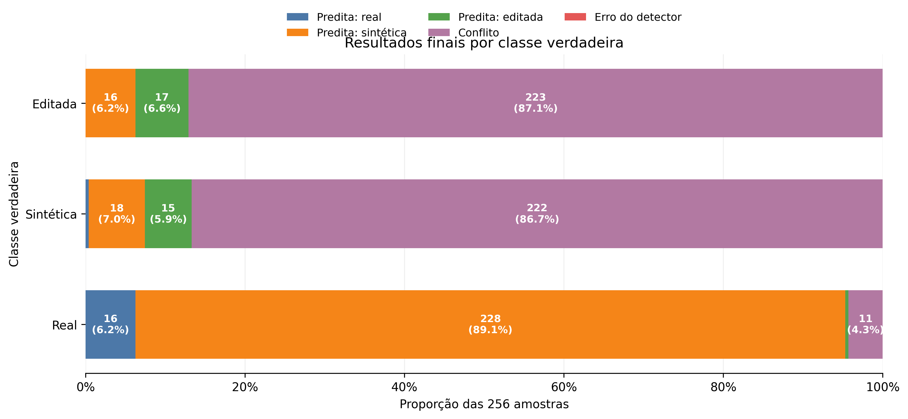
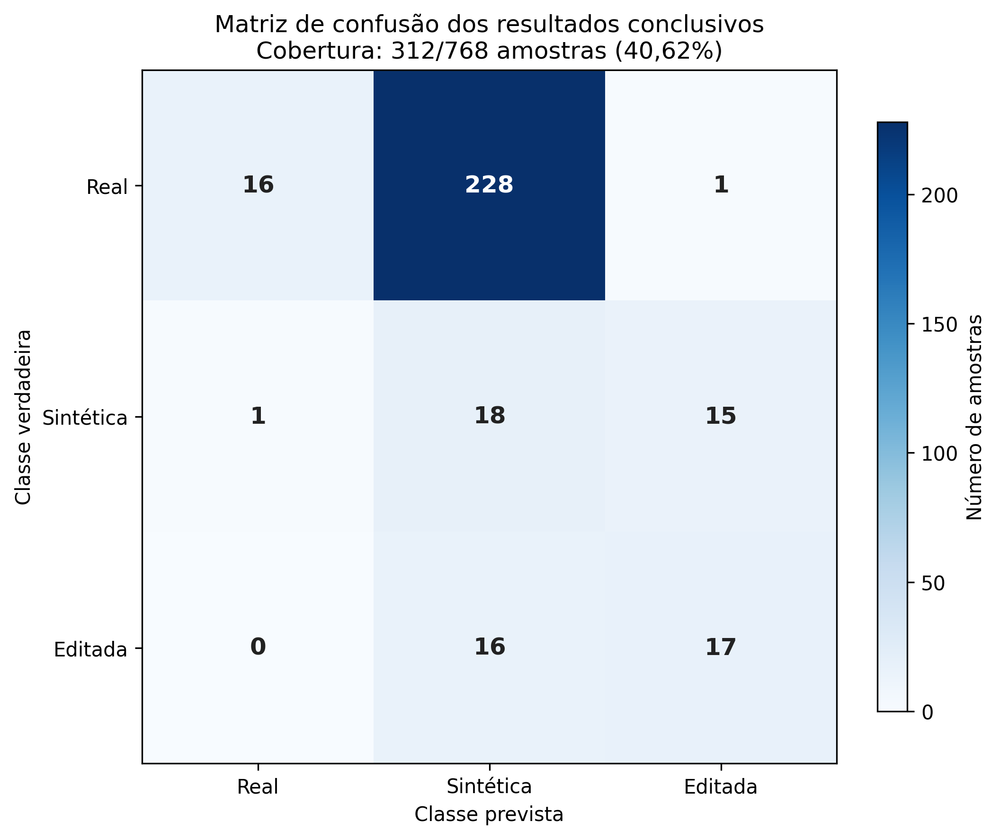
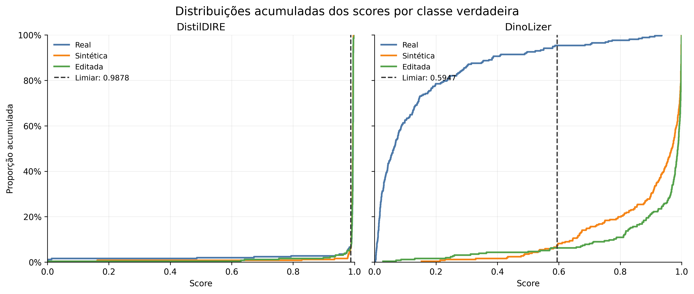

# Three-class pipeline validation

This experiment evaluates the frozen DiffDetect baseline composed of
DistilDIRE, DinoLizer, and the conservative Boolean aggregation rule described
in [`three-class-validation-plan.md`](three-class-validation-plan.md). The run
completed successfully on all 768 images. Its engineering integration is
valid, but its three-class classification performance is not acceptable.

This is a negative baseline result, not evidence that the framework itself is
inoperable. Both detector adapters ran without errors, produced scores and
localization outputs, and were combined reproducibly. The failure is specific
to the frozen operating points and the current aggregation rule.

## Frozen evaluation

- Protocol: `diffdetect-three-class-v1`
- Manifest: 768 images, with 256 `real`, 256 `synthetic`, and 256 `edited`
- Manifest SHA-256:
  `9dcda4b93d8c73df7b1240629bec209566cd6119bb7f800c2906b8c3826b8777`
- DistilDIRE revision: `5de48cf255411b3f47833822e0afec32b2d66e61`
- DistilDIRE threshold: `0.9877818822860718`
- DinoLizer revision: `3241ce530a685e6e0560db4e0d8aaa9f28de6fc6`
- DinoLizer threshold: `0.5946570634841919`
- Environment: Google Colab, Tesla T4, Python 3.13.15, PyTorch
  2.11.0+cu130, torchvision 0.26.0+cu130, and CUDA 13.0
- Result SHA-256:
  `b6788b97a249ccf6d4ab2c7fc1ea4d3149a9707371aa3ad1eeb9f588743a141a`
- Status: 768/768 samples completed, with zero DistilDIRE errors and zero
  DinoLizer errors

The first full attempt was invalidated because the Hugging Face cache stored
in Drive was corrupted. DinoLizer failed on every sample while loading a
safetensors file with `header too large`. No rows from that attempt are used
here. A clean run used a local runtime cache and reproduced the three-sample
smoke test before processing the complete manifest. The warning about
unauthenticated Hugging Face requests affected only rate limits, not inference.

## Final outcomes

The table includes inconclusive conflicts and retains all 768 samples in the
denominator.

| True class | Predicted real | Predicted synthetic | Predicted edited | Conflict | Detector error |
| --- | ---: | ---: | ---: | ---: | ---: |
| Real | 16 | 228 | 1 | 11 | 0 |
| Synthetic | 1 | 18 | 15 | 222 | 0 |
| Edited | 0 | 16 | 17 | 223 | 0 |

### End-to-end metrics

| Metric | Result |
| --- | ---: |
| Accuracy, with inconclusive samples counted as errors | 6.64% |
| Balanced accuracy | 6.64% |
| Macro precision | 50.83% |
| Macro recall | 6.64% |
| Macro F1 | 10.15% |
| Coverage | 40.62% (312/768) |
| Conflict rate | 59.38% (456/768) |
| Detector-error rate | 0.00% |
| Accuracy conditional on a conclusive result | 16.35% |
| Macro F1 conditional on a conclusive result | 25.30% |

The conclusive-only figures are secondary metrics. They do not compensate for
the low coverage and should not be presented as system-level accuracy.

| True class | Precision | Recall | F1 |
| --- | ---: | ---: | ---: |
| Real | 94.12% | 6.25% | 11.72% |
| Synthetic | 6.87% | 7.03% | 6.95% |
| Edited | 51.52% | 6.64% | 11.76% |

The confusion matrix below contains only the 312 conclusive predictions.

## Detector behavior

| True class | DistilDIRE positive | DinoLizer positive |
| --- | ---: | ---: |
| Real | 239/256 (93.36%) | 12/256 (4.69%) |
| Synthetic | 240/256 (93.75%) | 237/256 (92.58%) |
| Edited | 239/256 (93.36%) | 240/256 (93.75%) |

DistilDIRE was positive at almost the same rate for every true class. Its
frozen threshold therefore supplied little class-specific evidence on this
corpus and caused 228 real images to be labeled synthetic. DinoLizer retained
good real-versus-edited behavior, but it was also positive on 92.58% of the
fully synthetic images. Consequently, both detectors were positive on 456
images, including 86.72% of the synthetic class and 87.11% of the edited
class. The Boolean rule represents all of these cases as conflicts.

The score distributions reinforce this diagnosis. DinoLizer separates most
real images from both artificial classes, while its image-level score alone
does not cleanly separate fully synthetic from edited images. DistilDIRE's
scores are concentrated near one for all three classes. Raw scores remain on
different detector-specific scales and are not compared directly.

## Runtime

| Stage | Mean | Median | 95th percentile |
| --- | ---: | ---: | ---: |
| DistilDIRE | 0.9341 s | 0.9299 s | 0.9422 s |
| DinoLizer | 0.7282 s | 0.8960 s | 1.0499 s |
| Complete pipeline | 1.6723 s | 1.8268 s | 1.9889 s |

The first sample took 20.7077 seconds because it also included lazy loading:
13.5125 seconds in DistilDIRE and 7.1886 seconds in DinoLizer. Initialization
was not timed separately, so these values must not be interpreted as steady
inference times. The complete shell command took 21 minutes and 59 seconds.
Peak GPU memory was 3.262 GiB allocated and 4.385 GiB reserved.

## Interpretation

The current result rejects the hypothesis that two independently calibrated
Boolean decisions can be combined by the simple conflict rule to form a
useful three-class classifier on this corpus. It does not reject the modular
architecture: the detector contract, registry, runner, error isolation,
localization output, metadata, and reproducible experiment all worked as
intended.

The hierarchical aggregation proposed in TCC I is not yet implemented by the
baseline `classify` function. TCC I describes a first level that determines
whether there is evidence of artificial generation or manipulation and a
second level that determines the modality. The evaluated function instead
treats simultaneous synthetic and edited evidence as an unresolved conflict.
The 59.38% conflict rate shows why the hierarchy is a required component rather
than an optional refinement.

The next experiment should therefore keep this Boolean rule unchanged as the
versioned baseline and implement a separate hierarchical aggregator. Its
development may use these results only as exploratory evidence. Because this
validation set has now been inspected, thresholds or aggregation parameters
derived from it require a new, independent confirmation set before making a
final performance claim.

## Limitations

- Real and edited images are paired CocoGlide examples, while synthetic images
  come from DiffusionDB; dataset, content, resolution, and file-format cues may
  be confounded with class.
- The two detector thresholds were calibrated independently on different
  tasks and data distributions.
- DistilDIRE's preliminary threshold was not supported by a large held-out
  calibration comparable to the DinoLizer protocol.
- The evaluated generators and editing methods do not represent all diffusion
  models or manipulation types.
- The current corpus can support diagnosis and exploratory aggregation design,
  but it can no longer be treated as blind confirmation for a rule designed
  after observing these results.

## Versioned artifacts

The compact source results, derived tables, metrics, figures, and their hashes
are stored in [`results/`](results/). Exact checksums are listed in
[`results/three-class-validation-artifacts.sha256`](results/three-class-validation-artifacts.sha256).
